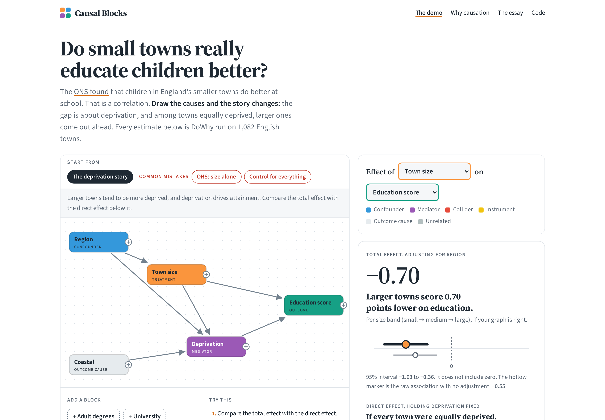
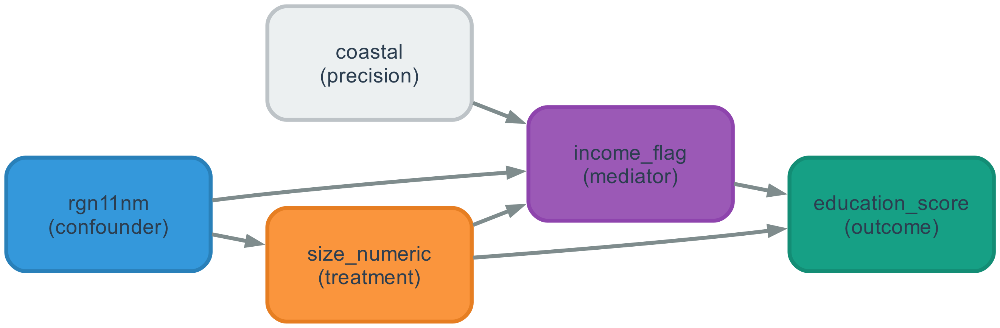
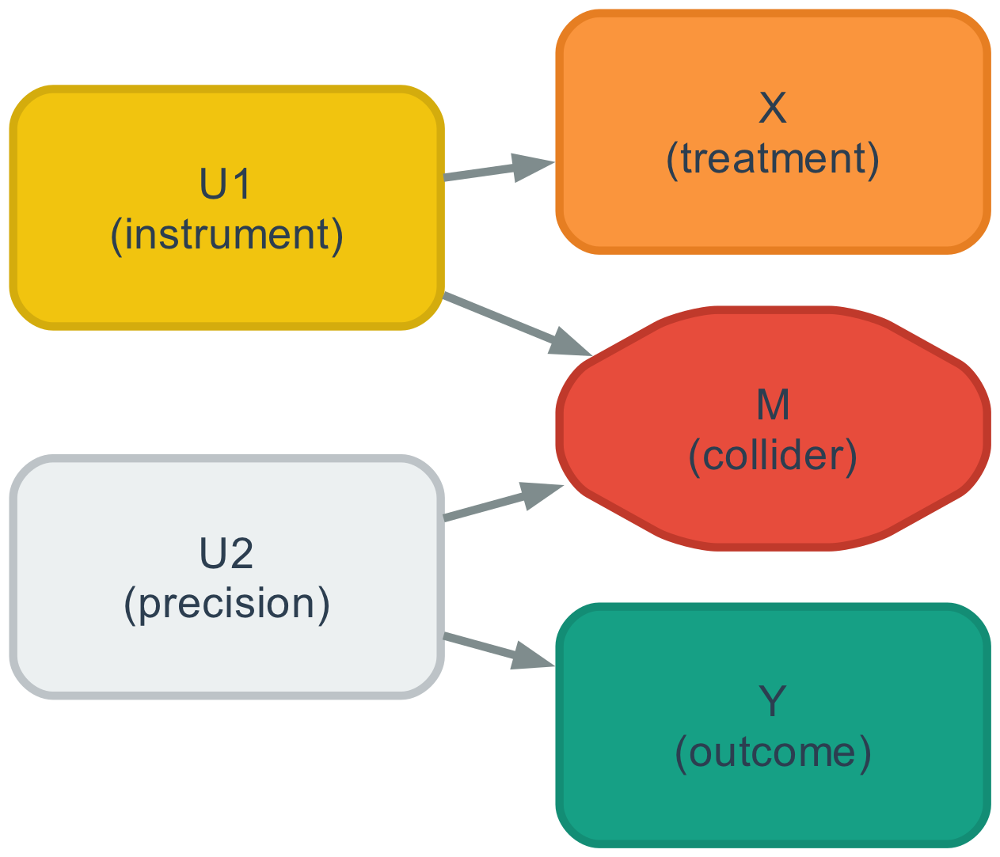

# Causal Blocks

**Learn causal inference by drawing it.** Drag your data's columns onto a canvas
as blocks, draw arrows for what you believe causes what, and watch a
[DoWhy](https://github.com/py-why/dowhy) estimate change with every arrow. Each
variable is coloured by the role your graph gives it — confounder, mediator,
collider — so the graph explains itself.

### → [causalblocks.com](https://causalblocks.com)

- **[The demo](https://causalblocks.com/)** — do small towns in England really
  educate children better? The published correlation, the result of
  "controlling for everything", and the causal story, on one dataset.
- **[Try your own data](https://causalblocks.com/try.html)** — upload a CSV and
  draw your own graph. Estimates appear instantly and are then confirmed by
  DoWhy running in your browser. Your data never leaves your computer.
- **[Why causation](https://causalblocks.com/about.html)** — what causal
  inference is, why "just control for it" is not the fix, and what to read next.

[](https://causalblocks.com)

Everything here is open source: the site, the Python library behind the
analysis, and the tests that check the site's answers against DoWhy itself.

---

## The example: do small towns provide better education?

England's smaller towns post better
educational outcomes than its larger ones. Adjust for deprivation and the
advantage does not merely disappear — **it reverses.**

| Large vs small towns | Effect | p |
|---|---|---|
| **Total effect** (adjusting for region) | **−1.28** points | 0.001 |
| ↳ flowing through deprivation | −1.99 points | |
| **Direct effect** (deprivation held fixed) | **+0.70** points | 0.022 |

The deprivation gap between England's least and most deprived towns is **5.18
points — 1.43 standard deviations**, about four times the size of the largest
town-size gap. Small towns are not better at educating children. They are less
deprived, and that is what the headline is measuring.

→ **[Read the analysis](notebooks/01_small_towns.ipynb)** ·
[the concepts it rests on](notebooks/00_concepts.ipynb)

Data: ONS, *Educational attainment of young people in English towns* (2023),
[OGL v3.0](data/README.md). 1,082 towns.

---

## The tool

Building that analysis needed a causal graph in three places at once — as a
picture to think with, as a DOT string for [DoWhy](https://github.com/py-why/dowhy),
and as a NetworkX graph for its GCM module. Writing it three times means three
chances to write it differently.

So you author it once:

```python
from causalblocks import CausalDAG

dag = (
    CausalDAG()
    .add("region",    to=["deprivation", "town_size"])
    .add("town_size", to=["deprivation", "attainment"])
    .add("deprivation", to=["attainment"])
    .add("attainment")
)

dag.draw("town_size", "attainment")   # a diagram
dag.to_dot()                          # -> dowhy.CausalModel(graph=...)
dag.to_networkx()                     # -> dowhy.gcm
```



### The part worth stealing

**Every colour in that diagram is computed.** Whether a variable is a
confounder, a mediator, a collider or an instrument is a property of the graph
plus the treatment and outcome you chose — so it is derived, never declared.

This started as a bug in my own analysis. The first version let you pass a
colour with each node, and I labelled deprivation a **confounder**, because that
is what it intuitively feels like. But I had wired it as
`town_size → deprivation → attainment`. That is a **mediator**. The picture and
the graph said different things, and nothing caught it, because the colour was
an assertion sitting next to the structure rather than a consequence of it.

It mattered: adjusting for a confounder removes bias, while adjusting for a
mediator silently changes *which effect you estimated*. That distinction turned
out to be the entire finding.

Deriving one from the other makes the disagreement impossible to express:

```python
>>> print(dag.explain("town_size", "attainment"))
MEDIATOR: deprivation
    adjusting for it gives the DIRECT effect, not the total effect
CONFOUNDER: region
    adjust for it -- it is a common cause and leaves an open backdoor path

WHAT A BACKDOOR ADJUSTMENT GIVES YOU:
    Adjusting for {region} -> TOTAL effect (through every pathway).
    Adding the mediator(s) {deprivation} -> DIRECT effect only.
    These answer different questions. Say which one you report.
```

The general move: when two things must agree, do not validate them against each
other — derive one from the other, and the failure mode stops existing.

### Simulate with a known answer

Edge weights make the true effect computable in closed form, via Wright's
path-tracing rule. So you can plant an effect and check an estimator finds it:

```python
import statsmodels.api as sm
from causalblocks import simulate, true_total_effect, m_bias

def ols(df, treatment, outcome, controls=()):
    design = sm.add_constant(df[[treatment, *controls]])
    return sm.OLS(df[outcome], design).fit().params[treatment]

dag = m_bias()                      # X and Y have no causal link at all
df  = simulate(dag, n=40_000, seed=20260807)

true_total_effect(dag, "X", "Y")    #  0.0     by construction
ols(df, "X", "Y")                   # -0.006   correct
ols(df, "X", "Y", controls=["M"])   # -0.201   invented from nothing
```



`M` is a **collider**. Adjusting for it opens a path that was closed and creates
an effect where there is none. Adding a control variable made a correct estimate
wrong — which is why "control for everything" is not a safe default, and why the
graph has to come first. [Worked through here](notebooks/00_concepts.ipynb).

---

## Reading it

Nothing to install. Both notebooks render on GitHub with every chart, table and
printed result inline, exactly as they ran:

- **[01_small_towns.ipynb](notebooks/01_small_towns.ipynb)** — the analysis
- **[00_concepts.ipynb](notebooks/00_concepts.ipynb)** — the mechanics, on
  simulated data where the true answer is known

<details>
<summary>Running it yourself</summary>

Python 3.11+, and [Graphviz](https://graphviz.org/download/)
(`brew install graphviz` / `apt install graphviz`).

```bash
git clone https://github.com/george-lindley/causal-blocks && cd causal-blocks
python -m venv .venv && source .venv/bin/activate
pip install -e ".[dev]"
pytest
jupyter lab notebooks/
```

</details>

## Layout

```
causalblocks/
  dag.py        CausalDAG: build, infer roles, explain, draw, export
  simulate.py   linear-Gaussian SCM + closed-form ground truth
  examples.py   three graphs with known answers
  plot.py       charts used in more than one notebook
  style.py      role -> colour
notebooks/
  00_concepts.ipynb     confounder / mediator / collider, on data with known truth
  01_small_towns.ipynb  the analysis
site/           causalblocks.com: static pages, no server
  js/causal.js      DoWhy's adjustment-set choice and variable roles, in JavaScript
  js/estimate.js    DoWhy's linear-regression estimate and refuters, in JavaScript
  js/dowhy-worker.js  real DoWhy in the browser (Pyodide), confirming each answer
  data/demo.json    every DoWhy result the demo can show, precomputed
scripts/
  build_demo_data.py      runs DoWhy for every demo combination
  build_essay_figures.py  the essay's charts, from the data
essay/          the write-up, and its figures
docs/dowhy-reference.md
tests/          50 tests, including the site against DoWhy
```

## On the design

This began as nine modules and 634 lines. Four of them were pass-throughs
(`do_op.py` was `df.copy()` plus an assignment; `regression.py` was 21 lines
around `sm.OLS`), and `dowhy.py` was 208 lines of `print()` behind a
`dowhy_help(topic)` dispatcher — documentation wearing a function call as a
disguise, not testable and not linkable. It is now
[a markdown file](docs/dowhy-reference.md).

What replaced them is smaller *and* does more, because the work moved from the
caller into the module. Callers used to assemble `list[dict]` by hand and decide
what each node was; now they describe the structure and ask. The interface got
narrower as the capability grew, which is the trade
[Ousterhout](https://web.stanford.edu/~ouster/cgi-bin/book.php) argues for and
the thing I was actually trying to learn here.

Two defects surfaced on the way, both of the kind that hide until they matter:

- The simulator walked nodes in **authoring order** and `KeyError`ed if a child
  was defined before its parent. It worked only because I had happened to write
  the example graphs in topological order.
- Every edge weight was hardcoded to 1.0, so there was no way to plant a known
  effect and verify it was recovered — the one thing a teaching simulator is
  for.

## Why this exists

I did a Masters in Business Analytics. It taught estimation in real depth —
regularisation, cross-validation, standard errors — and nothing about
**identification**: whether the quantity you want can be recovered from the data
you have, under assumptions you are willing to write down.

Those are different skills, and the second one gates the first. You can fit a
flawless model to a quantity that is not the one you meant, and nothing in the
output will tell you. The small-towns result is what that looks like in
practice: a correct regression, a real correlation, and an interpretation that
points at scale when the answer is money.

## Get in touch

Causal Blocks is made by George Lindley. If you teach statistics, analytics or
data science and would like to use it, have a dataset that would make a good
lesson, or want to collaborate, email
george.j.lindley+causalblocks@gmail.com or find me on
[LinkedIn](https://www.linkedin.com/in/georgelindley/). Bugs and suggestions
are welcome as [GitHub issues](https://github.com/george-lindley/causal-blocks/issues).

## Licence

Code MIT. Data Crown copyright under [OGL v3.0](data/README.md) — contains
public sector information licensed under the Open Government Licence v3.0.
